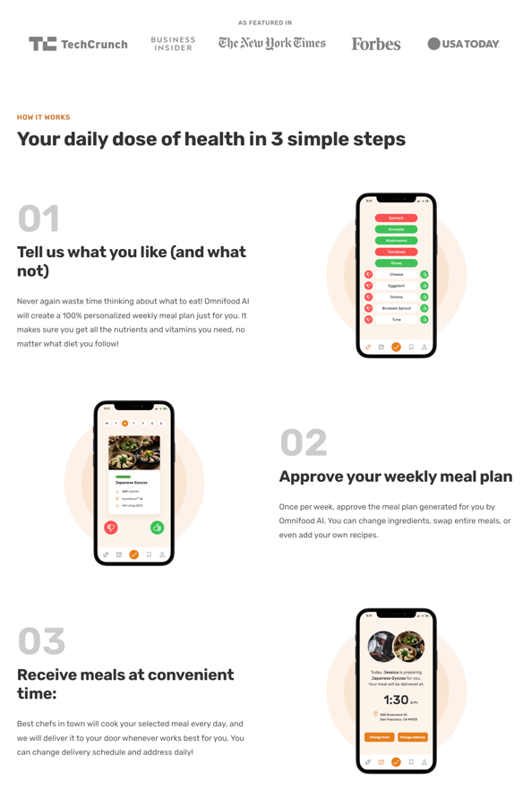
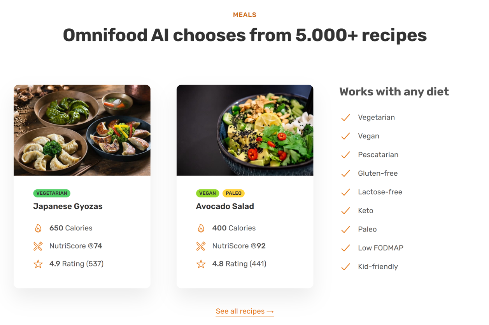
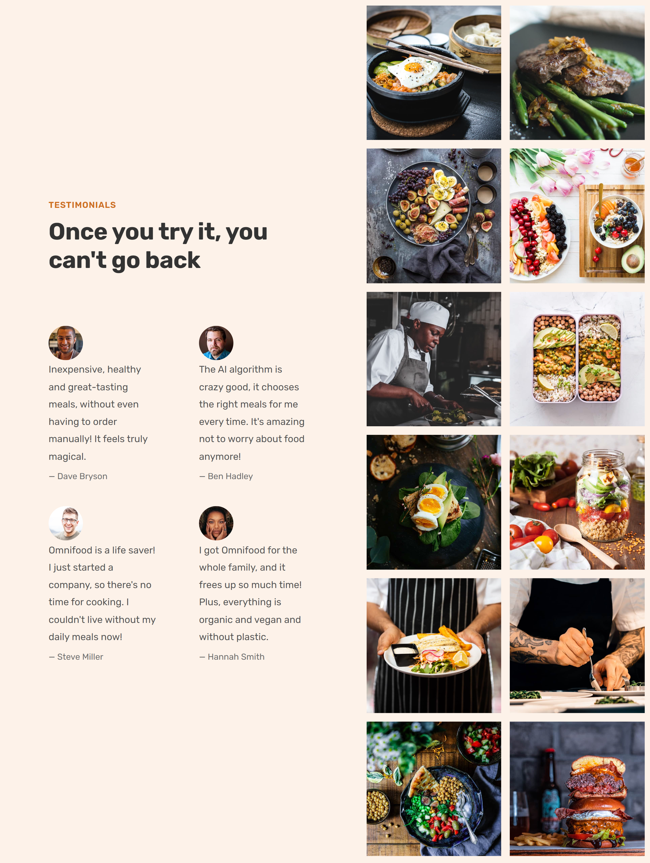
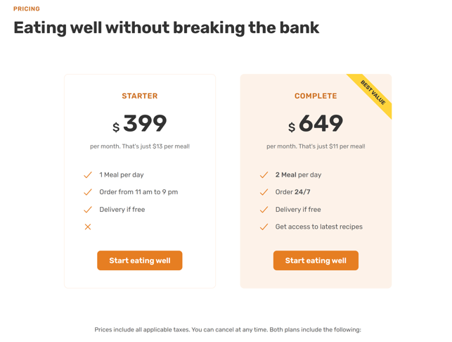
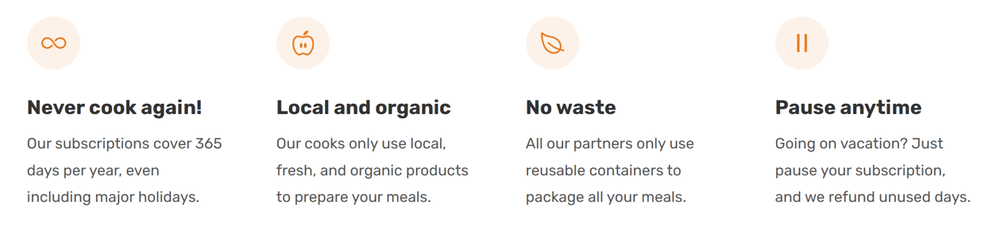
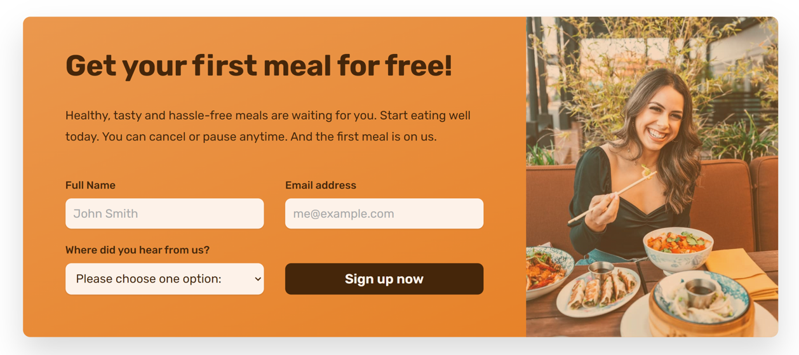

# OMNIFOOD

Projeto feito no curso "Build Responsive Real-World Websites with 
HTML and CSS" da UDEMY, onde se retrata da venda de um serviço
que é a entrega de comidas todo o dia.

## Screenshots

- Hero Section

<!-- 
- How it works

- Meals

- Testimonials

- Pricing

- Feature

- CTA

 -->

## Documentação de cores

| Cor         | Hexadecimal                                                             |
| ------------| ----------------------------------------------------------------------- |
| PRIMARY     | #e67e22                                                                 |
| TINTS       | #fdf2e9 &mdash; #fae5d3 &mdash; #eb984e                                 |
| SHADES      | #cf711f &mdash; #45260a                                                 |
| GREYS       | #888888 &mdash; #767676 &mdash; #6F6F6F &mdash; #555555 &mdash; #333333 |

## Tecnologias Utilizadas

